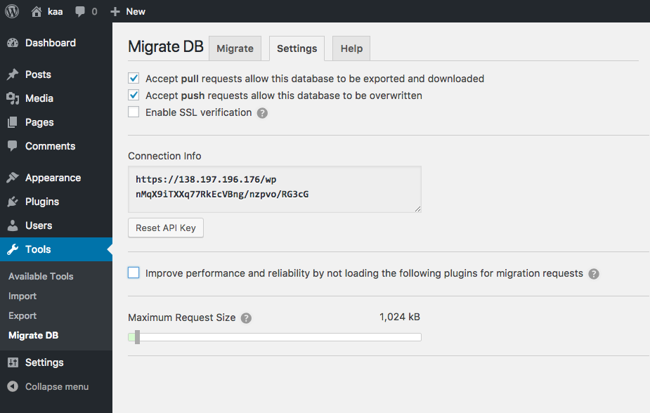
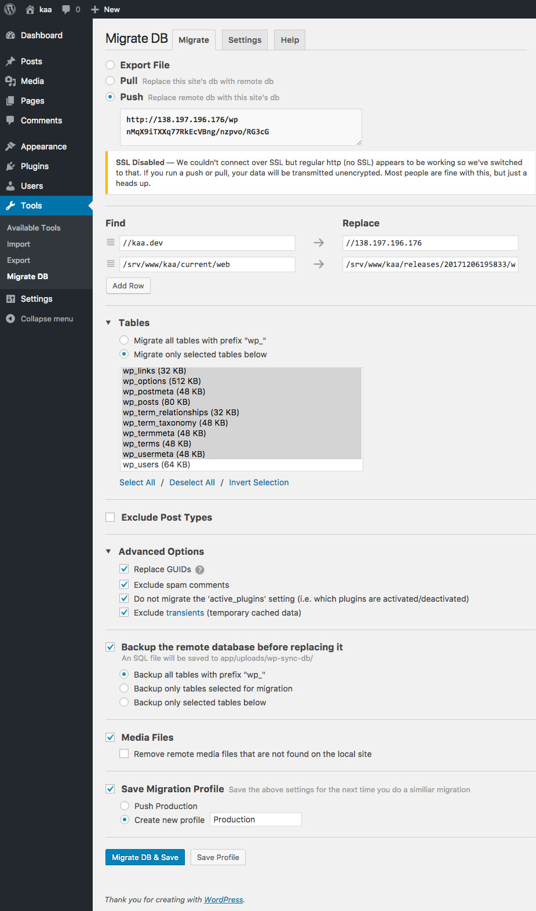
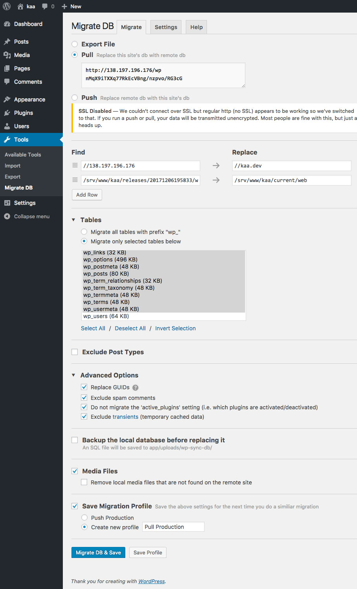

# Syncing Dev, Staging, and Production Environments

Keeping things synced between environments is tricky and there are a couple ways to do it. This walk-through just covers the most basic setup where you have a production site that the client has access to where they can add/update content and you work on a local version for development and testing.

## Tools of the trade

- [WP Sync DB](https://github.com/wp-sync-db/wp-sync-db) - Push and pull database tables between WordPress installations
- [WP Sync DB Media Files](https://github.com/wp-sync-db/wp-sync-db-media-files) - Sync media libraries between WordPress installations

**Note:** These are an older, open source version of [WP Migrate DB Pro](https://deliciousbrains.com/wp-migrate-db-pro/).

## Initial plugin setup

Activate the WP Sync DB and WP Sync DB Media Files plugins both on production and your development environment if you haven't already.

### 1. Get API Key from Production

Log in to Production and navigate to "Tools", then "Migrate DB" in the left-hand menu.

Click the "Settings" tab and do the following:

1. Check the "Accept pull requests…" option.
1. Check the "Accept push requests…" option.
1. Copy the link in the "Connection Info" box.

Now the plugin is able to receive a database update from an external site (our Development site)

### 2. Add API Key to Development

Log in to Development and navigate to "Tools", then "Migrate DB" in the left-hand menu.

#### 2.1 Setup Push

On the "Migrate" tab and do the following:

1. Choose the “Push” option.
1. Paste the production site’s connection info into the text area that appears (what we copied in the previous step).
1. Under Tables:
	- Select "Migrate only selected tables below"
	- Click "Select All"
	- Unselect the "wp_users" option (Command-Click)
	- (We do this so we don't override the Prod users)
1. Under Advanced options:
	- Check the “exclude spam comments” option.
	- Check the “Do not migrate the 'active_plugins...” option.
1. Check the “Backup the remote database before replacing it” option.
1. Check the “Media Files” option.
1. Check the “Save Migration Profile” option and create a name "Push to Production" so you don't have to configure this again.

Once all these settings have been updated, click the gray “Save Profile” button.

#### 2.1 Setup Pull

On the "Migrate" tab and do the following:

1. Choose the “Pull” option.
1. Setup everything like you did for Push.
1. Check the “Save Migration Profile” option and create a name "Pull from Production" so you don't have to configure this again.

Once all these settings have been updated, click the gray “Save Profile” button.

## Workflows

### Pull from Production

#### Reasons to pull from production

- You joined an existing project and are setting up your local Development environment to match Production
- The client has added content to Production that you want to view/test locally

#### Steps

1. Log in to **Development** and navigate to "Tools", then "Migrate DB" in the left-hand menu.
1. On the "Migrate" tab click the "Pull Production" profile
1. Click the blue "Migrate DB & Save" button

### Push to Production

**DANGER ZONE!** - Pushing to Production will overwrite it's database so it will match your local Development. (See [Merge Conflicts](#merge-conflicts) below)

#### Reasons to push to Production

- You are setting up the server for the first time and want to deploy your content

#### Steps

1. Log in to **Development** and navigate to "Tools", then "Migrate DB" in the left-hand menu.
1. On the "Migrate" tab click the "Push Production" profile
1. Click the blue "Migrate DB & Save" button

## Merge Conflicts

The biggest issue potential issue is if you add content locally and the client also adds content to the live site at the same time. If you push from dev to prod you will overwrite the client's changes.

**There are a couple strategies to mitigate this**

- Only add content to Production
- Communicate with the client and other developers about who is adding content and pushing
- Keep track of changes you made locally and manually add them to Production

If you have a site with lots of developers working on it and lots of content constantly being added you can purchase [Mergebot](https://mergebot.com/) (starting at $249 a year). This plugin automatically includes [WP Migrate DB Pro](https://deliciousbrains.com/wp-migrate-db-pro/) and adds the ability to merge databases and resolve conflicts.

